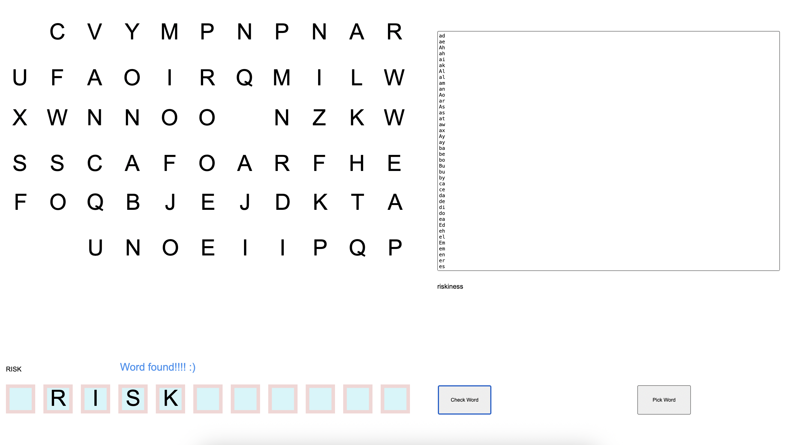

# WordGame 🎮🧠

**WordGame** is a simple project built using [Construct 3](https://www.construct.net/) that serves as the foundation for a word-based puzzle game. It currently demonstrates how to efficiently load and parse a large English word list (over 200,000 words) from a text file.

This repository is intended for learning, experimenting, and eventually expanding into a fully playable word game.

  
   
  <a href="https://hielo777.github.io/WordGame/">
    Click here to try the demo >>
  </a>

---

 📥 How to Use / Run 

1. Open the project with **Construct 3** (https://editor.construct.net/).
2. Run the layout or preview the project.
3. The game will load the word list automatically and store it for future use in gameplay.

> Make sure you have access to the internet or a licensed version of Construct 3 if using features that require it.
>> The basic versions of this projects should be under the free version restrictions, to allow anyone to check it out

(<a href="#readme-top">⬆  back to top  ⬆</a>)

---

 📦 Features 

- [x] Loads a large, ordered list of English words (200,000+ entries).
- [x] Lightweight and minimal use of Construct 3 events.
- [x] Designed to be modular and easy to expand into a full game.
- [x] Exported HTML files that can be used to test the game when deployed in a server.
- [x] Sample project that illustrates how to pick a random word from the dictionary.
- [x] Sample project has basic game mechanics that:
> - Loads a grid of random letters at the start of the layout
> - Allow players to drag the random letters to alloted letters paces
> - Allow players to form words that can be searched in the loaded dictionary
> - Takes the word formed by the players and shows if the word is in the dictionary

(<a href="#readme-top">⬆  back to top  ⬆</a>)

---

 🚧 Future Plans 

## 

Planned features for upcoming versions include:

- [ ] A basic game mechanic that allows players to drag and arrange letters to form words.
- [ ] Improve word search mechanic in the sample project.
- [ ] Real-time validation of user-created words against the loaded dictionary.
- [ ] Scoring, time-based challenges, and other gameplay elements.
- [ ] Improved UI/UX and mobile support.
- [ ] Add a *Publish* section detailing how to test a web version of the game.

(<a href="#readme-top">⬆  back to top  ⬆</a>)

---

 🛠️ Built With 

- [Construct 3](https://www.construct.net/) – Visual game engine used to create and manage the project.

A million thanks to the [Construct community](https://www.construct.net/en/forum) and to the kind people of [Scirra](https://www.construct.net/en).

(<a href="#readme-top">⬆  back to top  ⬆</a>)

---

(<a href="#readme-top">⬆  back to top  ⬆</a>)
